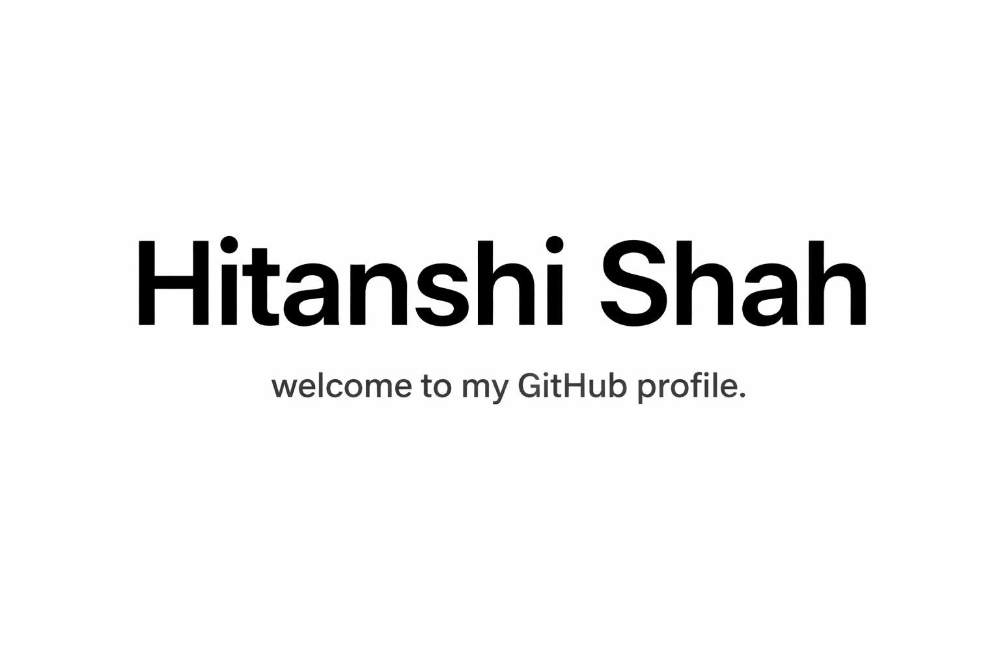

<h1 align="center">
  
</h1>

<h2 align="center">Hey there, welcome to my GitHub! 👋</h2>

# Hi, I'm Hitanshi Shah ✨

🚀 **Data Analyst | Data Engineer | SQL | Python | ETL | Power BI | Cloud Analytics**

🌟 I’m passionate about transforming raw data into meaningful insights, scalable pipelines, and business-driven solutions.

📊 From building dashboards and analyzing trends to validating pipelines and improving data workflows, I enjoy solving problems that create real impact.

🛠️ My work spans **data analytics, data engineering, SQL-based problem solving, ETL validation, dashboarding, machine learning, and cloud-powered solutions**.

💡 I love using data to uncover stories, improve decision-making, and build systems that are both reliable and insightful.

📫 Reach out if you’d like to collaborate on **data, analytics, BI, ETL, or machine learning** projects!

✨ Let’s turn data into decisions! ✨

 ### Profile Views : 

---

## 🌟 Featured Projects

<h2 style="color: #4285F4;">📊 Data Analytics & Business Intelligence</h2>

#### [SQL Music Store Analysis](https://github.com/Hitanshi06/SQL_Music_Store_Analysis)
* **[Tech Stack]**  

- Solved business-driven SQL problems using joins, CTEs, aggregations, and subqueries.
- Analyzed customer behavior, revenue patterns, and top-performing music genres.
- Demonstrated strong SQL fundamentals for analytical and reporting use cases.

#### [ROAD ACCIDENTS ANALYSIS](https://github.com/Hitanshi06/ROAD-ACCIDENTS-ANALYSIS)
* **[Tech Stack]**  

- Analyzed accident trends and identified high-risk patterns using data exploration and visualization.
- Built reporting workflows to make raw accident records easier to interpret.
- Focused on converting large datasets into actionable safety insights.

---

<h2 style="color: #4285F4;">⚙️ Data Engineering & Pipeline Projects</h2>

#### [Energy Intelligence Platform](https://github.com/Hitanshi06/Energy-Intelligence-Platform)
* **[Tech Stack]**  

- Built a data-focused platform to monitor energy trends and support smarter resource decisions.
- Worked on transformation, analytics, and reporting workflows across business datasets.
- Combined engineering and analytics concepts to drive data-backed operational insights.

#### [AI-Powered Labor Market Analytics Dashboard](https://github.com/Hitanshi06/AI-Powered-Labor-Market-Analytics-Dashboard)
* **[Tech Stack]**  

- Designed an analytics dashboard to study layoffs, hiring patterns, and labor market signals.
- Used data storytelling and visual exploration to make workforce trends easier to understand.
- Built the project to support practical, insight-driven career and hiring analysis.

---

<h2 style="color: #4285F4;">🤖 Machine Learning & Predictive Analytics</h2>

#### [Olympic Data Analyzer with Prediction](https://github.com/Hitanshi06/Olympic-Data-Analyzer-with-Prediction)
* **[Tech Stack]**  

- Built a predictive analytics project using historical Olympic data.
- Explored medal trends, participation patterns, and country-level performance.
- Applied machine learning techniques to generate prediction-driven insights.

#### [Sales Forecasting Regression](https://github.com/Hitanshi06/Sales_forecasting_Regression)
* **[Tech Stack]**  

- Built regression-based forecasting models to estimate future sales outcomes.
- Performed data cleaning, trend analysis, and model evaluation.
- Focused on generating interpretable outputs for business planning.

#### [Sentiment Analysis using Python](https://github.com/Hitanshi06/Sentiment_Analysis-using-Python)
* **[Tech Stack]**  

- Built an NLP workflow to classify sentiment from text data.
- Cleaned and transformed unstructured text for downstream modeling.
- Used machine learning to uncover patterns in user opinions and feedback.

---

## ⚡ Tech Stack

### 👩‍💻 Languages

### 📊 Analytics & BI

### 🏗️ Data Engineering

### ☁️ Tools & Cloud

---

## 📬 Connect With Me

---

✨ Thanks for visiting my GitHub profile!
